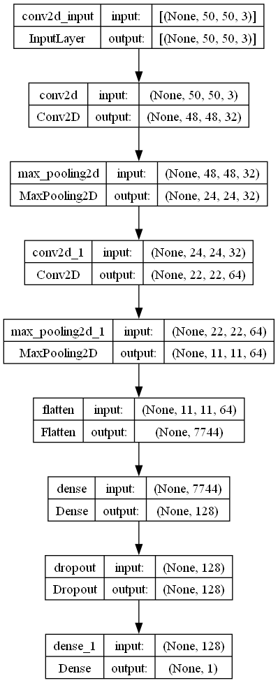

# DeepVisionDroneClassifier

## Introduction
**DeepVisionDroneClassifier** is a TensorFlow-based deep learning project designed for the accurate detection and classification of drones in aerial images. Utilizing convolutional neural networks (CNNs), this repository provides a robust solution for enhancing security and surveillance systems by automating drone detection.

## Project Overview
The project employs advanced image processing techniques and deep learning algorithms to train a model that can distinguish between drone-containing images and those without drones. It's built using TensorFlow and leverages OpenCV for image manipulations, ensuring high accuracy and real-time processing capabilities.

## Model Creation Process
### Data Collection
The first step in the process involved gathering a diverse dataset consisting of thousands of labeled images divided into two categories:
- Drone images
- Non-drone images

### Preprocessing
Images were preprocessed to standardize their size to 256x256 pixels and normalize pixel values. This step ensures that the model trains on uniform data, improving its ability to learn and generalize.

### Model Architecture
We designed a CNN architecture with the following layers:
- **Convolutional Layers**: To extract features from the images.
- **Activation Layers (ReLU)**: To introduce non-linearity into the model.
- **Pooling Layers**: To reduce the spatial dimensions of the output volumes.
- **Fully Connected Layers**: To output the final classification probabilities.

### Training
The model was trained using:
- **Optimizer**: Adam
- **Loss Function**: Binary Crossentropy
- **Metrics**: Accuracy

Training involved numerous epochs with validation splits to monitor and prevent overfitting.

### Evaluation
Post-training, the model was evaluated on a separate test set to verify its accuracy and robustness. The performance metrics were documented to assess the model's practical applicability.

## Visualization of Model Architecture
<table>
  <tr>
    <td>
      
    </td>
    <td>
      The image illustrates the architecture of the DeepVisionDroneClassifier, a convolutional neural network designed for drone detection.<br>
      The model begins with an input layer that accepts images sized 50x50 pixels.<br>
      It includes multiple convolutional layers with increasing filter depths to extract features, interleaved with max pooling layers for dimensionality reduction.<br>
      The network concludes with a fully connected dense layer, a dropout layer for regularization, and a final dense layer for classification output, indicating the presence of a drone.<br>
      This architecture is optimized for effective feature learning and generalization in drone imagery analysis.
    </td>
  </tr>
</table>

## Usage
Ensure you have Python installed and then install the required dependencies:
```bash
   pip install -r requirements.txt
```
     
## Installation
Clone the repository and install the required dependencies:
```
git clone https://github.com/EdenChai/DeepVisionDroneClassifier.git
cd DeepVisionDroneClassifier
pip install -r requirements.txt
```

## Contributing
Contributions to the **DeepVisionDroneClassifier** are welcome! Please refer to the contributing guidelines before making a pull request.

## License
This project is licensed under the MIT License
